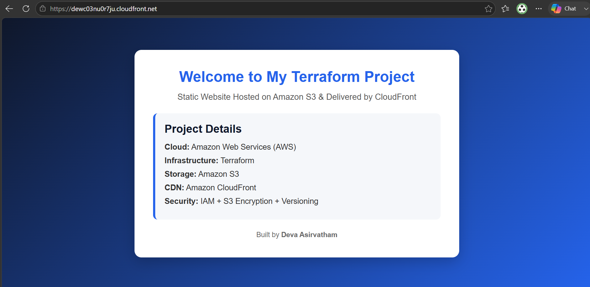
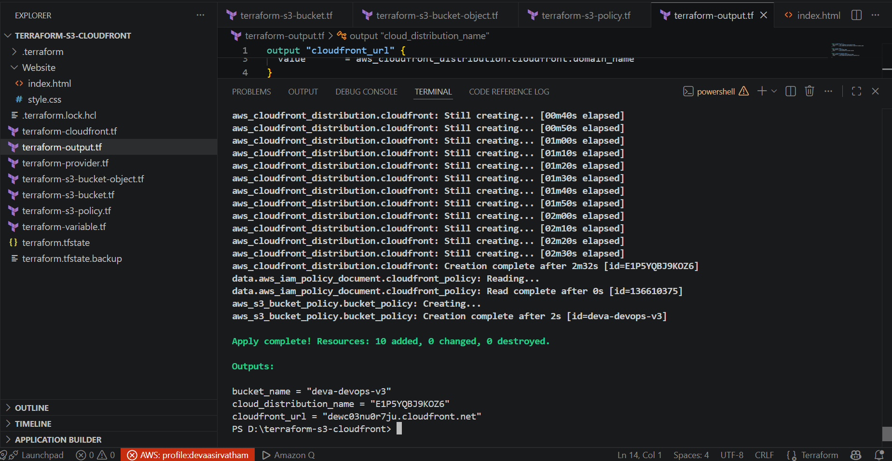

<div align="center">

# Static Website Hosting on AWS with S3 and CloudFront

### Secure, Private-Bucket Static Hosting Provisioned Entirely with Terraform

[](https://www.terraform.io/)
[](https://aws.amazon.com/)
[](#license)
[](#live-demo)

</div>

---

## Table of Contents

- [Overview](#overview)
- [Architecture](#architecture)
- [Live Demo](#live-demo)
- [Deployment Output](#deployment-output)
- [Key Features](#key-features)
- [Project Structure](#project-structure)
- [Prerequisites](#prerequisites)
- [Configuration](#configuration)
- [Usage](#usage)
- [Outputs](#outputs)
- [Security Design](#security-design)
- [Cleanup](#cleanup)
- [Technologies Used](#technologies-used)
- [Author](#author)

---

## Overview

This project provisions **secure static website hosting on AWS**, built entirely as Infrastructure as Code with Terraform. Rather than relying on a public S3 bucket — a widely known anti-pattern — the bucket stays completely private, and all traffic is routed through **Amazon CloudFront** using **Origin Access Control (OAC)**.

The result is a hosting setup that is fast, globally distributed, encrypted at rest, and locked down so that only CloudFront  and no other principal can read from the bucket.

---

## Architecture

```
                     ┌──────────────────────┐
   User Request ───► │   CloudFront (CDN)   │
                     │  + Origin Access     │
                     │    Control (OAC)     │
                     └──────────┬───────────┘
                                │
                                │  signed requests only
                                ▼
                     ┌──────────────────────┐
                     │      S3 Bucket       │
                     │    (fully private)   │
                     │  • Versioning        │
                     │  • AES256 Encryption │
                     │  • Public Access     │
                     │    Blocked           │
                     └──────────────────────┘
```

---

## Live Demo

<p align="center">
  
</p>

**Live URL:** [`dewc03nu0r7ju.cloudfront.net`](https://dewc03nu0r7ju.cloudfront.net)

---

## Deployment Output

Terraform provisioned all 10 resources successfully in a single `terraform apply`, returning the CloudFront domain, bucket name, and distribution ID as outputs.

<p align="center">
  
</p>

```text
Apply complete! Resources: 10 added, 0 changed, 0 destroyed.

Outputs:

bucket_name              = "deva-devops-v3"
cloud_distribution_name  = "E1P5YQBJ9KOZ6"
cloudfront_url           = "dewc03nu0r7ju.cloudfront.net"
```

---

## Key Features

| Feature | Description |
|---|---|
| **Private-only S3 bucket** | All public access blocked at the bucket level — no public ACLs, no public policy |
| **CloudFront + OAC** | Uses modern Origin Access Control (not the legacy OAI) to reach the private bucket |
| **Least-privilege IAM policy** | Bucket policy scoped to a single CloudFront distribution via a `SourceArn` condition |
| **Versioning** | S3 bucket versioning enabled for object history and recovery |
| **Encryption at rest** | AES256 server-side encryption applied to all stored objects |
| **Modern ownership model** | `BucketOwnerEnforced` ownership controls, replacing deprecated ACL-based access |
| **Modular Terraform code** | Configuration split by resource responsibility for clarity and maintainability |
| **Clean outputs** | CloudFront domain, bucket name, and distribution ID surfaced directly from `terraform apply` |

---

## Project Structure

```
terraform-s3-cloudfront/
├── terraform-provider.tf              AWS provider configuration
├── terraform-variable.tf              Input variable definitions
├── terraform-s3-bucket.tf             S3 bucket, versioning, encryption, ownership controls, public access block
├── terraform-s3-bucket-object.tf      Uploads website assets (index.html, style.css) to S3
├── terraform-s3-policy.tf             IAM policy document restricting bucket access to CloudFront
├── terraform-cloudfront.tf            CloudFront distribution and Origin Access Control
├── terraform-output.tf                Terraform outputs
├── Website/
│   ├── index.html                     Website homepage
│   └── style.css                      Stylesheet
├── screenshots/
│   ├── homepage.png                   Live site screenshot
│   └── terraform-apply.png            Terraform apply output
└── README.md
```

---

## Prerequisites

- Terraform `>= 1.5`
- An AWS account with configured credentials (`aws configure` or environment variables)
- IAM permissions to create S3 buckets, CloudFront distributions, and IAM policies

---

## Configuration

Define the following variables in a `terraform.tfvars` file:

```hcl
bucket_name   = "your-unique-bucket-name"
bucket_region = "us-east-1"
```

> S3 bucket names must be globally unique across all AWS accounts.

---

## Usage

```bash
terraform init
terraform plan
terraform apply
```

Confirm with `yes` when prompted.

> CloudFront distributions typically take 10–15 minutes to fully deploy — this is expected AWS behavior, not a failure state.

---

## Outputs

| Output | Description |
|---|---|
| `cloudfront_url` | Public CloudFront domain name |
| `bucket_name` | Name of the created S3 bucket |
| `cloud_distribution_name` | CloudFront distribution ID |

---

## Security Design

- **No public access, anywhere.** `block_public_acls`, `block_public_policy`, `ignore_public_acls`, and `restrict_public_buckets` are all set to `true` at the bucket level.
- **Scoped access only.** The bucket policy grants `s3:GetObject` exclusively to CloudFront, constrained further by a `SourceArn` condition tied to this specific distribution — no other CloudFront distribution or external caller can read the bucket.
- **Modern ownership model.** `BucketOwnerEnforced` disables ACLs entirely in favor of policy-based access control, aligned with current AWS guidance.
- **Encryption and recovery.** AES256 encryption is applied by default, and versioning protects against accidental overwrite or deletion.

---

## Cleanup

```bash
terraform destroy
```

---

## Technologies Used

- **Terraform** — Infrastructure as Code
- **Amazon S3** — Private object storage / website origin
- **Amazon CloudFront** — Content delivery network (CDN)
- **AWS IAM** — Least-privilege access control policies

---

## Author

Deva Asirvatham SJ
- GitHub: [devaasirvathamsj](https://github.com/devaasirvathamsj)
- Email: devaasirvathamsj@gmail.com

